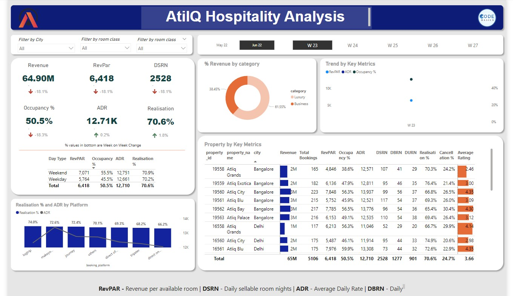

# AtilQ_Grands

The Challenge was all about creating a dashboard for the Revenue Management team of Atliq Grand hotel chain, which can provide key insights on Revenue trend .

Visualization Tool : PowerBi
Database : Excel

Process includes
1) Importing and verifying data. few transformations and cleaning in power query
2) Data modeling
3) Identifying & Creating Measures using DAX.
4) Validating all data
5) Creating Dashboard using appropriate Visualization.
